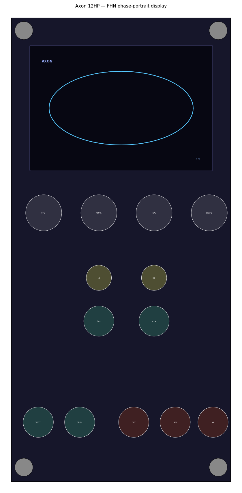

# Axon

Spiking-neuron oscillators for VCV Rack 2. This plugin contains two sibling
modules that use the same RK4 integration strategy: **Axon** (FitzHugh–Nagumo — spiking
and excitable) and **Soma** (Hindmarsh–Rose — bursting and chaos).

Both are **polyphonic** (up to 16 voices) — see [Polyphony](#polyphony) below.



Axon is a voice built on the **FitzHugh–Nagumo** (FHN) model — a two-variable
reduction of the Hodgkin–Huxley neuron. The membrane voltage `v` is the audio
output. Above a current threshold the neuron free-runs as a relaxation
oscillator (a slow charge-up followed by a fast spike); below threshold it sits
at rest and fires exactly one spike each time you trigger it. One knob —
**CURRENT** — moves you across that boundary (a Hopf bifurcation), so the same
module is a drone oscillator at one setting and a percussion/transient voice at
another.

## How it works

The state is two coupled variables in dimensionless time:

```
dv/dt = v − v³/3 − w + I        (fast: membrane voltage)
dw/dt = ε·(v + a − b·w)          (slow: recovery)
```

`v` rushes along the cubic nullcline and snaps back (the spike); `w` is the slow
recovery that drags it down and sets up the next spike. **ε** (EPS) is the ratio
of the two timescales — small ε gives a sharp relaxation spike, large ε a
smoother, near-sinusoidal swing. **a** (SHAPE) shifts the asymmetry / threshold.
`b` is fixed at 0.8.

The system is **stiff** (a fast variable riding a slow one), so the integrator is
the real work: each sample takes a number of **RK4 substeps**, and that number
adapts to pitch to hold the substep size near `0.05` — up to a cap of 64 substeps,
above which (roughly the top octave) the step grows and pitch trades some
integration accuracy for bounded CPU. A finiteness reset + state clamp are the
backstop if forcing ever pushes it to run away. The `f()` derivative and the RK4
step are written so the **Hindmarsh–Rose** sibling (Soma) uses the same integration
strategy with one extra equation.

### Pitch is the simulation *speed*

The limit-cycle period is **emergent** — it depends on CURRENT, EPS and SHAPE —
so pitch is **open-loop calibrated, not phase-locked.** V/OCT maps to how fast
dimensionless time advances, calibrated (`RATE_CAL`) so the default voicing reads
C4 at 0 V. Tracking is within ~1 cent across the useful range at default params,
but **changing CURRENT / EPS / SHAPE detunes the pitch somewhat** — that coupling
is deliberate and part of the instrument's character, not a bug.

## Controls

| Control | Range | Purpose |
| --- | --- | --- |
| **PITCH** | ±4 oct | simulation speed (audio pitch); 0 = C4 |
| **CURRENT** | −0.2 … 1.6 | injected current `I`; the excitability / bifurcation control. Rests at both ends, oscillates in a middle band (~0.33–1.42 at default shape) |
| **EPS** | 0.01 … 0.30 | timescale ratio `ε`; small = sharp spike, large = smoother/near-sine |
| **SHAPE** | 0.4 … 1.0 | waveform asymmetry `a` (threshold position) |

**CURRENT** and **EPS** each have an attenuverter + CV input (±5 V). **V/OCT**
sums with PITCH (no attenuverter). **TRIG** injects a short decaying current pulse
on each rising edge — from rest that fires one spike (percussion); inside the
oscillating band it perturbs the phase. **SYNC** is a hard reset: a rising edge
re-seeds the orbit at the rest fixed point, so clocking it locks the cycle (and
sweeping a master against it gives the classic hard-sync timbre). There is no
mode switch: the regime is set purely by where CURRENT sits, and triggers are
honoured in both.

Outputs: **OUT** — the membrane voltage `v`, soft-clipped to ±5 V (`tanh`) and
internally DC-blocked at ~20 Hz (the limit cycle's mean is not zero). **SPIKE** —
a 10 V / ~1 ms pulse on each upward threshold crossing of `v` (one per spike, with
hysteresis so a noisy peak can't double-fire). **W** — the recovery variable as a
slow correlated ±5 V CV, intentionally *not* high-passed.

## Display

The screen traces the **phase portrait** in the `(v, w)` plane — the FHN limit
cycle is a glowing closed orbit, and a trigger from rest shows as a single loop
that jumps out and relaxes back. The two faint guides are the **nullclines**
(the cubic `v`-nullcline and the straight `w`-nullcline); their intersection is
the fixed point whose stability CURRENT controls, so you can watch the orbit grow
as CURRENT crosses into the oscillating band. The trail is read lock-free from a
~45 Hz snapshot — fine for a visualiser.

## Patches

`tools/make_patches.py` writes six smoke-test patches into `patches/` (and copies
them into the Windows Rack patches folder if present):

- **axon_1_freerun** — default voicing → audio; play V/OCT
- **axon_2_blips** — sub-threshold CURRENT, an LFO square clocking TRIG (one spike
  per clock); take OUT for the spike voice
- **axon_3_selfevolving** — W self-patched into CURRENT CV: a slow wandering
  texture that rides its own recovery variable
- **axon_4_crossmod** — VCO SAW into CURRENT CV for FM-like sidebands
- **axon_5_sync** — a master VCO square clocking SYNC: hard sync. Sweep Axon's
  PITCH against the master for the classic sync-sweep timbre
- **axon_6_poly** — 4 voices spread across both pitch (a chord) and CURRENT, so
  each traces a differently-sized limit cycle: four coloured orbits on the scope
  (the portrait is pitch-invariant, so CURRENT is what separates them). OUT is
  summed back to mono through Sum

## Notes / known limits

- **Pitch is emergent / approximate.** CURRENT, EPS and SHAPE pull the pitch a
  little (see above) — deliberate, not a bug. Calibration targets C4 at the
  default voicing.
- **Aliasing.** Spikes are sharp and the `tanh` soft-clip adds harmonics, so high
  notes can alias. The right-click **Anti-aliasing** option (Off / ×4 / ×8,
  default ×4) oversamples the whole output chain — DC-block + tanh — and decimates
  with a windowed-sinc FIR, which band-limits both the spike and the nonlinearity.
  Higher factors cost more CPU (scaling with voice count); turn it Off if you're
  CPU-bound and not playing high notes.
- **State is not saved.** `v`, `w` are transient and re-seed at rest on load;
  params persist. Deliberate.
- **DC.** OUT is DC-blocked (the limit-cycle mean ≠ 0). W is intentionally not
  blocked — it's a slow correlated CV.
- **SR changes** need no handler: the only SR-derived cached state (the DC-blocker
  cutoff) is refreshed when the sample rate changes; everything else recomputes
  per sample.

`tools/stability_test.cpp` is a standalone replica of the kernel: it measures the
dimensionless period to set `RATE_CAL`, sweeps CURRENT × EPS × SHAPE × pitch and
asserts `v`,`w` stay finite/bounded, and checks V/OCT tracking.
`tools/render_wav.cpp` auditions voicings offline (writes WAVs).

```bash
g++ -O2 -o /tmp/t tools/stability_test.cpp && /tmp/t     # exit 0 = pass
python3 tools/panel_diagram.py                            # panel footprint check
```

---

# Soma

Soma is Axon's sibling, built on the **Hindmarsh–Rose** (HR) model. HR adds a
third, *slow* state variable `z` (adaptation) to the two fast variables, and that
extra variable is exactly what turns single spikes into **bursts** — trains of
spikes separated by quiescence — and, in a window of injected current, into
**chaos**. As in Axon, the membrane potential `x` is the audio output and pitch
is the simulation speed.

## How it works

```
dx/dt = y − a·x³ + b·x² − z + I      (fast: membrane potential, audio out)
dy/dt = c − d·x² − y                 (fast recovery / spiking)
dz/dt = r·( s·(x − x_R) − z )         (slow adaptation / bursting)
```

The fast `(x, y)` pair spikes much like Axon; `z` integrates slowly (rate `r`) and
pulls the current down until the cell falls silent, then drifts back and lets the
next burst start. **CURRENT** (`I`) sets the regime — quiescent → tonic spiking →
bursting → chaos. **BURST** (`r`) is how slow that adaptation is: small `r` = long
slow bursts, large `r` → tonic spiking. **ADAPT** (`s`) is the adaptation strength
(burst depth/shape). `a, b, c, d, x_R` are fixed at the standard HR values.

It uses the **same RK4 integration strategy as Axon** — pitch-adaptive substepping —
just with the third equation added.

### Pitch tracks the spike rate

HR's period varies enormously between regimes (a tonic spike train is ~3× faster
than the within-burst spikes at the default voicing), so pitch is calibrated to
the **within-burst spike rate**: `RATE_CAL` makes the default bursting voicing buzz
at C4. Switching to tonic spiking therefore reads about an octave-and-a-half higher,
and CURRENT/BURST/ADAPT pull the pitch — open-loop and deliberate, like Axon.

## Controls

| Control | Range | Purpose |
| --- | --- | --- |
| **PITCH** | ±4 oct | simulation speed (audio pitch); 0 = C4 at default voicing |
| **CURRENT** | 0.4 … 4.0 | injected current `I`; regime control (quiescent / tonic / bursting / chaos). Chaos sits near 3.25 |
| **BURST** | r ≈ 0.001 … 0.05 | adaptation rate (log-mapped); small = long bursts, large = tonic |
| **ADAPT** | 1.0 … 5.0 | adaptation strength `s` (burst depth) |

**CURRENT** and **BURST** have attenuverters + CV inputs. **V/OCT** sums with
PITCH. **TRIG** injects a decaying current pulse on each rising edge — from a
sub-threshold CURRENT that kicks off a single burst (a percussive HR voice).
**SYNC** hard-resets the cell (all three state variables) to rest on a rising
edge, for rhythmic locking and hard-sync timbres.

Outputs: **OUT** — `x`, soft-clipped (`tanh`) and DC-blocked. **SPIKE** — a
10 V / ~1 ms pulse per spike (so a burst emits a little flurry of triggers).
**Z** — the slow adaptation variable as a ±5 V CV: the **burst envelope**, ideal
for opening a filter/VCA in time with the bursts. Not high-passed.

## Display

The screen traces the HR attractor in the `(x, z)` plane: fast spikes sweep
horizontally while the slow `z` drifts up and down, so a burst reads as a cluster
of spikes climbing along `z` and the silent gap as the slow return. In the chaotic
window the trail never quite repeats. The faint diagonal is the `z`-nullcline
`z = s·(x − x_R)`, where the slow drift reverses.

## Patches

`tools/make_patches.py` also writes six Soma patches:

- **soma_1_bursting** — the default bursting voicing → audio
- **soma_2_chaos** — CURRENT = 3.25, the classic HR chaotic regime
- **soma_3_blips** — sub-threshold CURRENT, an LFO clocking TRIG to fire bursts
- **soma_4_zmod** — Z self-patched into CURRENT CV: a self-evolving burst texture
- **soma_5_sync** — an LFO clocking SYNC: each edge restarts the burst, locking it
  to the clock (rhythmic hard reset)
- **soma_6_poly** — 4 voices spread across pitch and CURRENT, the four currents
  walking from tonic spiking up into the chaotic window, so each coloured voice
  draws a distinctly different (x,z) attractor. Summed to mono through Sum

`tools/soma_stability_test.cpp` (calibration/stability/pitch) and
`tools/soma_render_wav.cpp` (offline audition) are the Soma counterparts of Axon's
tools. The same notes as Axon apply (state not saved, pitch approximate, OUT
DC-blocked / Z not, and the same right-click **Anti-aliasing** oversampling
option for high notes).

## Deferred

Closed-loop pitch tracking; per-spike velocity output; a regime/MODE switch to
recalibrate pitch to the burst (vs spike) rate.

## Polyphony

Both modules are polyphonic, up to **16 voices**, each an independent neuron with
its own integration state. The voice count is taken from the **V/OCT** cable's
channel count, falling back to **TRIG** — so a polyphonic gate/trigger (with no
pitch patched) gives you polyphonic percussion. Every CV input (CURRENT, EPS /
BURST, TRIG) is read per voice and normalled to channel 0 when it carries fewer
channels, and **OUT / SPIKE / W (Z)** are polyphonic. Knobs and attenuverters are
shared across all voices.

The display traces **every** active voice at once: each orbit is drawn on its own
hue, stepped across a narrow band around the module's accent colour (cyan for
Axon, amber for Soma), with a small `Nv` voice-count badge in the corner.

Feed them from a polyphonic source (a poly MIDI→CV, or `VCV Split`/`Merge`) and
sum the poly OUT with any mixer.

## References

- R. FitzHugh, *Impulses and physiological states in theoretical models of nerve
  membrane*, Biophysical Journal 1 (6), 1961.
- J. Nagumo, S. Arimoto, S. Yoshizawa, *An active pulse transmission line
  simulating nerve axon*, Proc. IRE 50 (10), 1962.
- [FitzHugh–Nagumo model — Wikipedia](https://en.wikipedia.org/wiki/FitzHugh%E2%80%93Nagumo_model)
- [Scholarpedia: FitzHugh–Nagumo model](http://www.scholarpedia.org/article/FitzHugh-Nagumo_model)
- J. L. Hindmarsh, R. M. Rose, *A model of neuronal bursting using three coupled
  first order differential equations*, Proc. R. Soc. Lond. B 221 (1222), 1984.
- [Hindmarsh–Rose model — Wikipedia](https://en.wikipedia.org/wiki/Hindmarsh%E2%80%93Rose_model)

## Build

```bash
# Linux
make RACK_DIR=~/Rack2-SDK/Rack-SDK dist

# Windows cross-compile (from WSL)
RACK_DIR=~/Rack2-SDK-win/Rack-SDK \
  CC=x86_64-w64-mingw32-gcc-posix CXX=x86_64-w64-mingw32-g++-posix \
  STRIP=x86_64-w64-mingw32-strip MACHINE=x86_64-w64-mingw32 make dist
```
